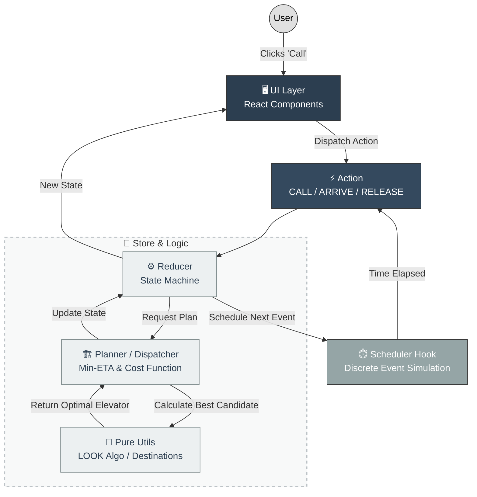

# 🏢 Elevator Simulation System


**[🚀 Live Demo](https://elevator-exercise-j6cehoc7s-amirs-projects-ef008757.vercel.app/)**

---

## ✨ Overview

This project simulates a smart elevator control system for a multi-floor building. It is engineered not just to satisfy the basic requirements, but to demonstrate **production-grade architecture** capable of handling high loads, concurrency, and real-time constraints.

---

## ⚡ Key Features

- **Intelligent Load Balancing:** Implements a fail-safe queuing mechanism with back-pressure handling. When system capacity (`MAX_DESTINATIONS`) is reached, requests are buffered and dynamically dispatched via a priority-based release strategy, ensuring **zero dropped calls** under high concurrency.

- **High-Performance Rendering:** Leverages hardware acceleration via `translate3d` to force GPU compositing. Optimized specifically for **120Hz ProMotion** displays (e.g., iPhone 15 Pro) to eliminate layout thrashing and ensure sub-pixel rendering precision.

- **Physics-UI Synchronization:** Bridges the domain gap between continuous CSS transitions and discrete JavaScript state logic. Uses a heuristic `POSITION_EPSILON` to reconcile floating-point variances, preventing visual artifacts (ghosting/jitter) during high-speed state mutations.

- **Built-in Observability:** Integrated telemetry engine capturing real-time KPIs (Wait Time, Travel Duration, Throughput). Provides actionable insights into algorithm efficiency and helps identify system bottlenecks.

---

## ⚖️ Architectural Decisions & Trade-offs

During the system design phase, I made several strategic decisions to prioritize **scalability**, **realism**, and **engineering robustness** over implementation simplicity. Here is the rationale behind the core architecture:

#### 1. Dispatching: Min-ETA vs. Naive Distance
* **The Challenge:** The easiest solution is to send the physically closest elevator. However, a "close" elevator (e.g., at floor 4) might have 5 stops pending, making it slower than a "far" elevator (e.g., at floor 8) that is completely idle.
* **My Solution:** I implemented a **Min-ETA (Estimated Time of Arrival)** cost function.
    * It calculates: `Travel Time + (Stops En-Route * Stop Delay) + Direction Penalties`.
    * It even considers `Arrived` elevators (waiting in cooldown) as valid candidates if their total ETA is lower.
* **The Trade-off:** Higher computational complexity ($O(N \cdot M)$) per dispatch, returned in significantly better average wait times and user experience.

#### 2. Event Loop: Discrete Event Simulation vs. Polling
* **The Challenge:** Most simulations use `setInterval` to check state every 100ms. This wastes CPU cycles and creates jittery animations if the main thread is busy.
* **My Solution:** I built a **Zero-Polling Architecture** using a custom `Scheduler`.
    * The system calculates the *exact* timestamp of the next event (`ARRIVE`, `RELEASE`) based on physics.
    * It schedules a single precision timer for that specific moment.
* **The Trade-off:** Debugging time-based logic is harder than simple loops, but the result is **deterministic 60fps performance** and zero unnecessary CPU usage.

#### 3. Traffic Control: The LOOK Algorithm & Single-Button Constraint
* **The Challenge:** The design spec provided only a single "Call" button (no Up/Down), creating ambiguity about user intent. Additionally, standard FIFO queues cause "starvation" and inefficient travel.
* **My Solution:** I implemented the **LOOK Algorithm** (a variant of SCAN).
    * Elevators continue in their current direction as long as there are requests ahead.
    * Since we lack directional input, the system uses a heuristic: if an elevator is moving Up and passes a called floor, it optimizes to pick up that passenger.
* **The Trade-off:** A complex algorithmic solution to a UI constraint, ensuring adherence to the "Pixel Perfect" design requirements without sacrificing operational efficiency.

#### 4. System Integrity: Queue Management (Load Balancing)
* **The Challenge:** What happens when all elevators are busy? A naive system might drop calls or overload a single elevator.
* **My Solution:** I implemented a **Queue System** with a `MAX_DESTINATIONS` cap.
    * If all elevators are at capacity, the call is pushed to a Global Pending Queue.
    * As soon as an elevator completes a trip (`RELEASE`), the system flushes the queue and assigns the pending call to the best available candidate.
* **The Trade-off:** Adds state management complexity but guarantees **Fail-Safe** behavior even under extreme load.

#### 5. Architecture: "Headless" Simulation Engine (Decoupling)
* **The Challenge:** Embedding complex business logic directly into React components creates "spaghetti code" that is hard to test and prone to unnecessary re-renders.
* **My Solution:** I completely decoupled the **Business Logic** (`store/planner`) from the **UI Layer** (`components`).
* **The Benefits:**
    1.  **Testability:** I can run fast Unit Tests (Vitest) on the entire elevator logic without the overhead of a browser or component rendering.
    2.  **Performance:** React acts purely as a View Layer. It only re-renders when the final state changes, avoiding expensive calculations during the render phase.
    3.  **Backend-Ready:** The system is effectively a portable library. It can be moved to a Node.js microservice in the future with zero code changes.

---

**Summary:**
> "I chose to build a **Simulation Engine**, not just a UI. This architecture prioritizes correctness, testability, and future scalability over quick-and-dirty implementation."

---

## 🧪 Testing Strategy

The project relies on a comprehensive "Testing Trophy" to ensure system stability and correctness.

| Type | Tool | Focus |
|------|------|-------|
| **Unit** | `Vitest` | **Pure Logic:** Validating `sortDestinationsLOOK` and ETA calculations in isolation from the UI. |
| **Component** | `Cypress` | **Visuals:** Verifying the `Building`, `Elevator`, and `Floor` components render correctly. |
| **E2E** | `Cypress` | **User Flows:** Simulating full lifecycles: Call -> Moving -> Arrived -> Release. |
| **Invariants** | `Runtime` | **Safety:** A dedicated module asserts system laws (e.g., "A moving elevator must have a destination") after every state transition in Dev mode. |

---

## ⚙️ CI/CD Pipeline

The project implements a comprehensive **Continuous Integration & Deployment** strategy using **GitHub Actions**, orchestrated via two specialized workflows:

### 1. 🧪 Continuous Integration (CI)
* **Trigger:** Runs on every Push or Pull Request to any branch.
* **Responsibilities:**
    * **Linting:** Static code analysis using ESLint.
    * **Unit Tests:** Logic validation using Vitest.
    * **Component & E2E Tests:** UI verification using Cypress.
* **Goal:** Serves as a "Quality Gate," ensuring that no broken code or regressions are ever merged into the codebase.

### 2. 🚀 Continuous Deployment (CD)
* **Target:** Vercel Production Deployment
* **The Flow:** `Tests (Safety Check)` → `Build` → `Deploy`.
* **Mechanism:**
    1.  **Validation:** Re-runs the full test suite to guarantee stability before building.
    2.  **Build:** Generates production assets (`pnpm build`).
    3.  **Deploy:** Automatically deploys the artifact to **Vercel**.
* **Goal:** Delivers the latest stable version to production with zero manual intervention.
---

## 🛠️ Project Structure



## 🚀 Getting Started

Prerequisites: Node.js 18+

```bash
# 1. Install dependencies
cd client && pnpm install

# 2. Run development server
pnpm dev

# 3. Run Unit Tests
pnpm test

# 4. Run E2E Tests
cd ../e2e && pnpm cypress:open